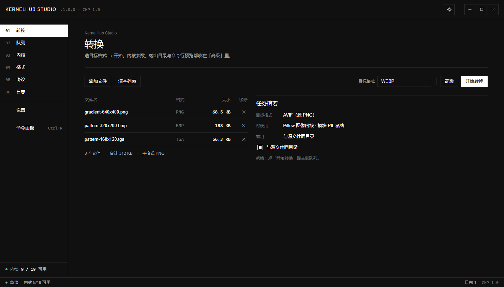
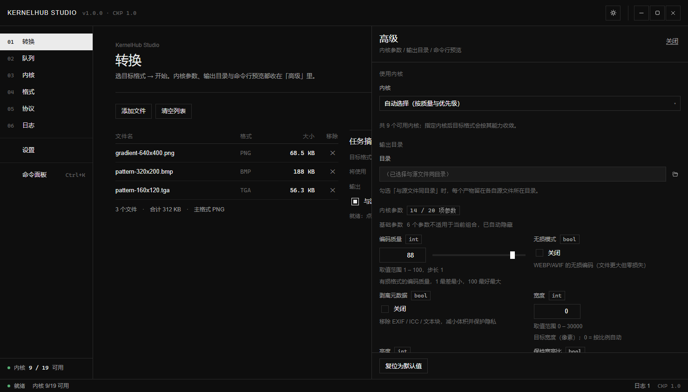
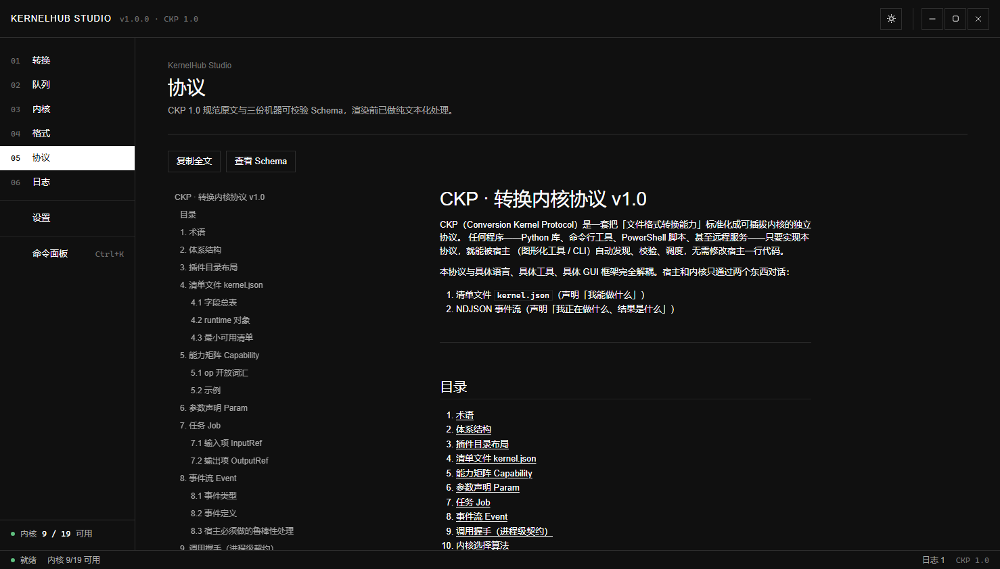

# KernelHub Studio

> CKP 协议驱动的文件格式转换工作台 —— Electron + Node.js。



---

## 软件介绍

> **把十几种文件格式转换工具，收进一个界面。**

不用记 ImageMagick 的参数，也不用为转一个 PDF 去翻 Pandoc 的文档。

拖进文件，选好格式，点开始。

### 转换能力来自插件

每个插件只做一件事：用一份清单说明「我能把什么转成什么、有哪些参数」，
再配一个适配器把活干完。

界面照着清单长出来 —— **加一种格式，不用改界面代码**。

* 引擎是现成的命令行工具 → 声明一下就好，不用写代码
* 引擎是某个 Python 库 → 写一个几十行的适配器
* 引擎是别的语言 → 协议只要求它读任务、吐事件

### 壳 + 插件

安装包只有 **89.9 MB**。

里面是界面、协议，和 4 个开箱可用的小插件 —— 装完就能转。

FFmpeg、PyMuPDF、Pillow、Office 文档这些大块头，在「插件」页按需下载。

每个插件自带自己的依赖，装 A 不会顺带拖下 B 的几十 MB。

### 主要能力

* **转换** —— 拖进文件、选目标格式，自动挑合适的内核
* **队列** —— 批量转换，并发可调，能暂停、取消、重试
* **插件** —— 已装的看状态和能力，没装的按需下载
* **格式 / 协议 / 日志 / 设置** —— 格式矩阵、协议规范、完整事件流

插件在界面上按「**类型 + 最典型的两个扩展名**」显示，例如「图片 PNG / JPG」「文档 PDF」，
其余支持的格式看详情页（能力矩阵里列全）。代码里的插件 id 与清单原名不受影响，
详情页会并列出来便于对照。

界面是瑞士风格：网格、无衬线、直角、无阴影，每屏按钮不超过 10 个。
页面只有标题，说明文字与实时数字都不占版面 —— 说明挂在元素的悬停提示上，
实时信息（可用内核、队列计数、当前显示条数、上次结果…）统一显示在**右下角状态栏**，
随视图自动切换。

动效克制但连贯：启动时有一段字标开启动画（播完再停留半秒）；侧栏与选项卡的选中块会
**滑动**过去；进度条走缓进缓出；通知卡片**整卡从右侧屏幕外滑入**，同类型互相覆盖
（而不是叠一屏长得一样的卡片），移除后其余卡片平滑让位。
所有动效都跟随系统「减少动态效果」偏好自动关闭。

插件缺 Python 依赖时会弹窗询问，可直接从**镜像或官方源**自动补齐（装进插件自己的
`vendor/` 目录，卸载时一并删除；pip 源可在设置里改）。

设置 → 关于 里有**检测更新**：到 GitHub Release 上查找**同大版本**里最新的版本
（2.x 只找 2.x，不会把 3.x 推给你），发现新版本可一键下载安装包并启动安装向导。

**界面语言**可在 设置 → 语言与区域 切换（简体中文 / English）。英文目前覆盖
导航、顶栏、状态栏、命令面板、通知与**整个设置页**；各视图正文将在后续版本补齐 ——
未覆盖的字符串按设计回退中文，不会出现空白。切换语言后界面会重新加载。

插件与工作区路径支持中文（含空格、全角字符）；`tools/verify-cjk-paths.js` 会把
纯中文目录、中文文件名、外部命令行内核（ffmpeg）、文本内核这几条链路全部跑一遍。

| | |
|---|---|
|  |  |
| 「高级」抽屉：参数由清单生成 | 协议规范：`PROTOCOL.md` 与 JSON Schema |

想深入了解：[架构与协议](docs/architecture.md) · [界面设计规范](docs/ui-spec-swiss.md)

---

## 客户端安装

> 2.2.7 起安装包是**自绘安装器（默认装到 D:\\KernelHub Studio，DPI 感知、高分辨率屏字体清晰）**（不再是 NSIS 界面）：无边框圆角窗口、品牌色大按钮、
> 圆角进度条；**按用户安装，不需要管理员权限**；自带卸载器，卸载不删插件与设置。

### 1. 下载

从 [Releases](https://github.com/sigewinner/kernelhub/releases/latest) 下载：

| 文件 | 大小 | 说明 |
|---|---|---|
| `KernelHub Studio-2.2.9-setup.exe` | 89.9 MB | 安装版：可选安装目录，自动建快捷方式 |
| `KernelHub Studio-2.2.9-portable.exe` | 89.6 MB | 便携版：免安装，首次启动要自解压，稍慢十几秒 |

### 2. 系统要求

* **Windows 10 / 11 x64**
* **系统 Python 3** —— 每个插件的适配器都是 `adapter.py`，需要 PATH 里能找到 `python`
* 转换特定格式还需要对应的外部程序（ImageMagick、FFmpeg、Pandoc、LibreOffice、Ghostscript、
  qpdf、7-Zip 等）。**不必先装**：插件列表里的「内核状态」列会直接告诉你缺什么。

### 3. 安装与使用

1. 双击安装（或直接运行便携版）
2. **首次启动会自动创建用户工作区，并把 4 个种子插件铺好** ——
   `stdlib-image`（纯标准库）、`text-markup`（自带 markdown/html2text）、
   `data-table`（自带 openpyxl）、`windows-wic`（Windows 自带 WIC）。
   不用联网、不用配置，装完即可转换。
3. 打开「转换」页，拖文件进去 → 选目标格式 → 开始转换
4. 需要更多格式时到 **插件**页（侧栏 03）安装：下载 → 自动刷新 → **新格式立刻出现在可选格式里**

### 4. 文件放在哪

| 路径 | 内容 |
|---|---|
| `%APPDATA%\kernelhub-studio\` | 设置、插件目录缓存 |
| `%APPDATA%\kernelhub-studio\hub\plugins\<id>\` | 已安装的插件（含各自的依赖） |
| `%APPDATA%\kernelhub-studio\hub\.cache\runs\` | 任务落盘（与内核进程交换的 job.json） |

### 5. 如果双击 exe 完全没反应

若安装目录被 Windows 标记为**低完整性**（部分开发目录、某些同步盘目录会这样），
Chromium 的渲染进程会被强制完整性控制（MIC）的 No-Write-Up 策略拒绝，
表现为双击 exe **毫无反应、连报错都没有**（退出码 `0x80000003`）。

**这不是程序问题，换到普通目录即可**：默认的 `%LOCALAPPDATA%\Programs\KernelHub Studio`
就是普通目录；便携版建议放到 `D:\Apps\` 或桌面一类的位置。

---

## 开发端安装介绍

### 环境

* **Node.js ≥ 18** + npm
* **Python 3**（PATH 里能找到 `python`）
* 可选：**git** —— 装了的话插件页会优先用稀疏克隆，只下载选中的那个插件

### 起步

```bat
git clone https://github.com/sigewinner/kernelhub.git
cd kernelhub
npm install                :: 只装 Electron 与 electron-builder，没有其它运行时依赖

npm start                  :: 桌面版；预检失败会自动降级到浏览器版并说明原因
npm run browser            :: 浏览器版（同一套界面 + 同一个引擎）
npm run diag               :: 环境诊断：Node / Electron / Python / CKP 工作区
```

`npm start` 走 `tools/launch.js`：先预检项目文件、Electron 运行时与**目录完整性**，
启动后 2.5 秒内判断窗口是否真的起来；失败时打印退出码 + 环境诊断 + 根因判断，
并自动用浏览器版拉起同一套界面。

### 打包

```bat
npm run build:dir        :: 只生成解包目录（最快，先验证能不能启动）
npm run build:portable   :: 便携版单文件 exe
npm run build:mirror     :: 安装包 + 便携版（国内网络走镜像，推荐）
npm run build:withhub    :: 一体化模式：把整个内核仓库也打进包（体积回到 1.x 水平）
```

产物在 `release/`。默认是**壳模式**：只带 SDK + 协议 + 4 个种子插件，
其余内核由用户在应用内按需下载。打包产物请**复制到普通目录再运行**（原因同上文的低完整性问题）。

完整流程（配置项、体积构成、常见失败）见 **[docs/build.md](docs/build.md)**。

### 验证

```bat
node tools\audit.js               :: 源码体检：编码完整性 / JS 语法 / 渲染层依赖边界
node tools\smoke.js               :: 引擎端到端：真实调用内核转换并校验产物
node tools\uiverify.js            :: 界面端到端：启动开发宿主 + Chrome，跑完整流程并截图
node tools\verify-motion.js       :: 动效逐帧采样：证明过渡真的在动（自检窗口不可见，看不到帧）

:: 打包产物
"KernelHub Studio.exe" --selftest --selftest-out=D:\report.json
node tools\verify-engine-in-electron.js --app <解包目录>
node tools\verify-plugin-install.js --app <解包目录> --id pillow-image
```

> `verify-motion.js` 解决一个具体的盲区：应用自检跑在**不可见**窗口里，而 Chromium
> 不为隐藏窗口产生帧，CSS 过渡会一直停在第 0 帧 —— 自检只能验证「目标值对不对、
> 过渡配置有没有生效」，验证不了「动画到底有没有在动」。这个工具用真实 Chrome
> 在 `requestAnimationFrame` 里逐帧读计算样式，把中间帧打印出来。

### 目录结构

```
kernelhub-studio/
├── src/
│   ├── shared/protocol.js   CKP 1.0 协议的 Node 权威实现
│   ├── engine/              内核中枢（纯 Node，可独立复用）
│   │                        含 pluginStore（按需安装）、download（多连接分片下载）、zipExtract
│   ├── main/                Electron 主进程 + preload 契约
│   └── renderer/            界面（HTML/CSS/原生 ES Module）
│       └── js/views/        7 个视图：转换 / 队列 / 插件 / 格式 / 协议 / 日志 / 设置
├── sdk/kernelhub/           CKP 适配器 SDK（Python 包，所有 adapter.py 依赖它）
├── protocol/                PROTOCOL.md 与 JSON Schema
├── seed-plugins/            随包预置的 4 个种子插件
├── tools/                   启动器 / 打包 / 各类验证脚本
└── docs/                    架构、打包、API 契约、UI 规范与截图
```

### 文档

| 文档 | 内容 |
|---|---|
| [docs/architecture.md](docs/architecture.md) | 协议实现、引擎分层、内核进程契约 |
| [docs/build.md](docs/build.md) | 打包与发布全流程 |
| [docs/renderer-api.md](docs/renderer-api.md) | 渲染层 API 契约（`window.khs`） |
| [docs/UI.md](docs/UI.md) · [docs/ui-spec-swiss.md](docs/ui-spec-swiss.md) | UI 实现说明 · 设计规范 |

---

## 许可

宿主（本项目的 Node/Electron 代码）为 MIT。
各外部内核的许可证随其 `kernel.json` 的 `license` 字段声明
（ImageMagick、Pandoc 为 GPL 系，PyMuPDF 为 AGPL，FFmpeg 为 LGPL/GPL），商用前请自行确认。
