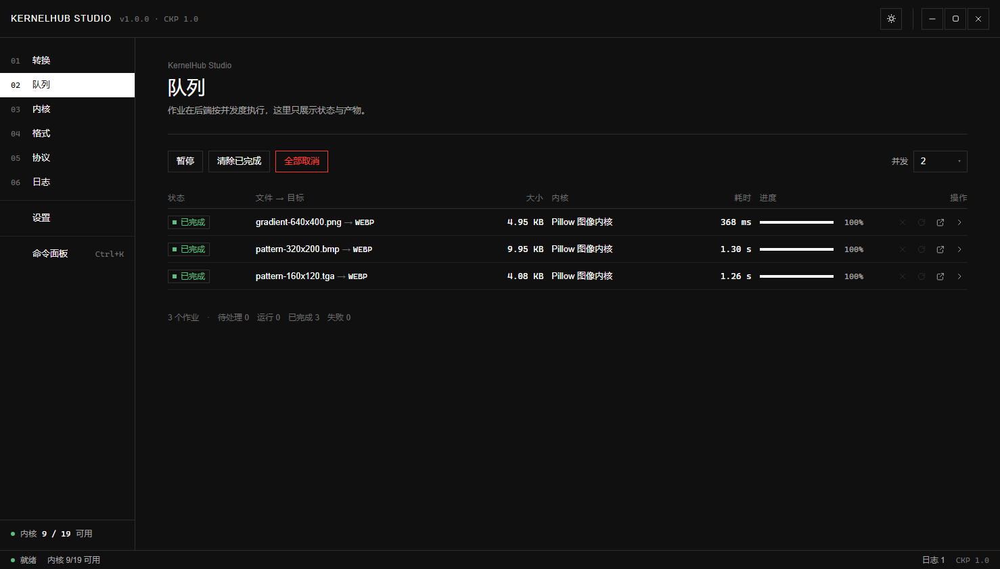
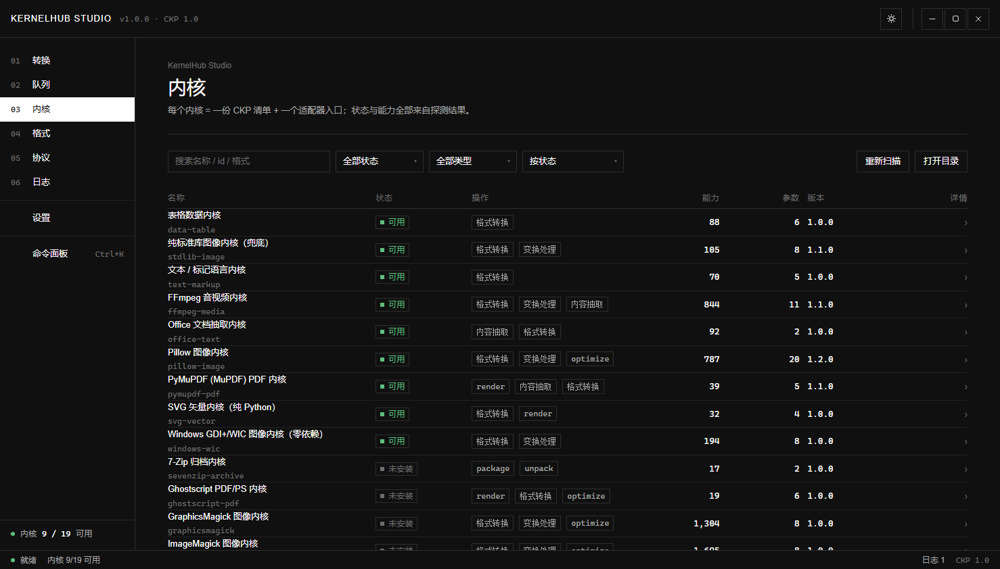
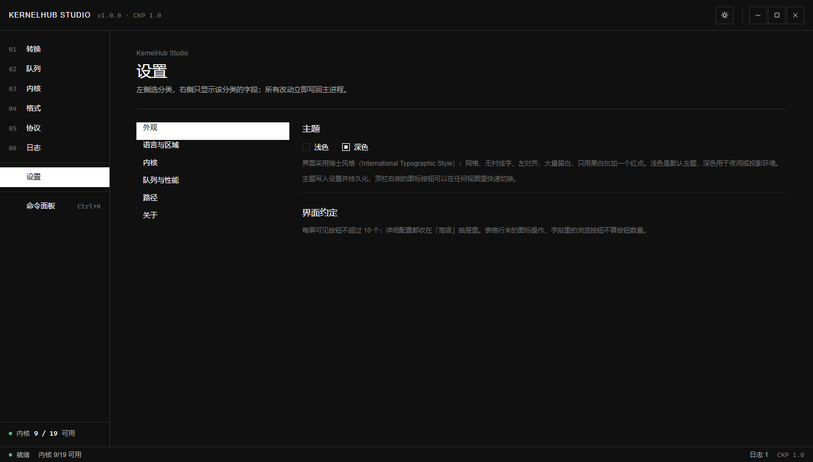
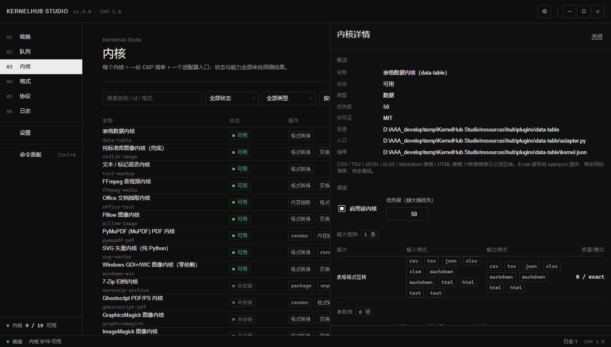

# KernelHub Studio

> 用 **Electron + Node.js + HTML/CSS/JS** 重构的格式转换工作台。
> 保留原项目的灵魂 —— **CKP（转换内核协议）**：所有转换能力由内核清单（`kernel.json`）声明，
> 宿主不写死任何格式名、参数名或工具名，界面完全由协议驱动生成。


---

## 和原项目的关系

| | kernel-hub（原项目） | kernelhub-studio（本项目） |
|---|---|---|
| 宿主运行时 | Python 3.8+ / Tkinter | **Node.js + Electron** |
| 界面技术 | Tkinter（原生控件） | **HTML + CSS + 原生 JS（无框架、零外部资源）** |
| 协议 | CKP 1.0（Python 权威实现） | **CKP 1.0（Node 侧独立实现，语义一致）** |
| 内核插件 | `plugins/<id>/{kernel.json, adapter.py}` | **原样复用，一个字节都不改** |
| 界面能力 | 内核列表 / 转换 / 日志 | **7 个工作区：转换、队列、内核、格式、协议、日志、设置**（瑞士风格，每屏按钮 ≤10） |
| 运行内核的方式 | `python adapter.py --ckp-job job.json` | **完全相同** |

**关键点：内核层没有变。** 内核是「读 `--ckp-job` 指向的任务、往 stdout 吐 NDJSON 事件」的任意程序，
换一个宿主照样跑。本项目把宿主从 Tkinter 换成了 Electron，并新增了一个 Node 实现的 CKP 运行器。

```
kernelhub-studio/                    kernel-hub/（原项目，只读复用）
├── src/shared/protocol.js   ──┐     ├── plugins/*/kernel.json   内核清单
├── src/engine/registry.js     │     ├── plugins/*/adapter.py    适配器
├── src/engine/runner.js       ├──▶  ├── vendor/                 Python 侧内核依赖
├── src/engine/hub.js          │     ├── protocol/schemas/       协议 Schema
├── src/main/main.js（Electron）│     └── .cache/runs/            任务落盘
└── src/renderer/（UI）      ──┘
```

---

## 快速开始

```bat
:: 1) 安装依赖（只装 Electron，无其他运行时依赖）
npm install

:: 2) 启动（会先做环境预检，桌面版起不来会自动降级到浏览器版并说明原因）
npm start                 :: 等价于双击 启动.bat

:: 想直接用浏览器界面（同一套 HTML/CSS/JS，后端同一个引擎）
npm run browser           :: 等价于双击 浏览器版.bat

:: 3) 环境诊断 / 自检（不启动界面，直接在控制台跑真实转换）
npm run diag              :: 只打印诊断：Node / Electron / Python / CKP 工作区
node tools\smoke.js       :: 也可以双击 自检.bat
```

启动后（默认进「转换」页）：

1. 把文件拖进左侧列表，或点「选择文件」；目录会被递归展开
2. 选**目标格式** → 右侧「任务摘要」实时显示将使用哪个内核
3. 点「**开始转换**」→ 去「队列」看进度、内核、耗时；「日志」里有完整的 NDJSON 事件流
4. 需要调内核参数 / 输出目录 / 看真实命令行：点「**高级**」（详细配置都收在这里）

> 示例素材：在「设置 → 内核」里点「打开内核目录」，或用 `node tools/fixtures.js <目录>`
> 生成一批示例文件（PNG/BMP/TGA/PPM/SVG/CSV/TSV/JSON/MD/HTML/TXT）。
> 素材由本项目自己手写编码生成，不依赖任何内核是否装好，第一次启动就能试。

### 桌面版窗口没出来怎么办（重要）

`npm start` 走的是 `tools/launch.js`，它会：

1. 预检项目文件、Electron 运行时与**目录完整性**（缺运行时会自动 `npm install`）
2. 启动 Electron，并在 2.5 秒内判断窗口是否真的起来了
3. **失败时打印退出码 + 环境诊断 + 根因判断**，然后自动以浏览器版拉起同一套界面

#### 最常见的根因：目录被标记为「低完整性」

如果你双击 `release\win-unpacked\KernelHub Studio.exe` **完全没有反应**（连报错都没有），
先跑这一条：

```bat
npm run integrity        :: 例：node tools\integrity.js "D:\AAA_develop\01_program_pdf"
```

如果输出里出现 `Low Mandatory Level` 与 `(NW)`，那就是**唯一原因**：

```
Mandatory Label\Low Mandatory Level:(OI)(CI)(NW)
```

* 这是 Windows 的**强制完整性控制（MIC）**，**不是文件权限，改 ACL / 换管理员运行都没用**；
* Chromium 的渲染进程与 GPU 进程以**低完整性**运行（这是它的沙箱机制），
  它们要在程序目录里创建文件、并向上请求更高完整性 —— 被 `(NW)`（No-Write-Up）直接拒绝；
* 于是浏览器内核在初始化阶段就被系统拒绝，退出码 `0x80000003`（`STATUS_BREAKPOINT`），
  主进程连一行 JS 都执行不到。

**已实测确认**：同一个 exe（SHA256 一致）在工作区内启动 40 秒内 0 个进程；
复制到 `%TEMP%` 后 4 秒出现窗口。这是内核策略层面的差异，与程序无关。

**两个立刻可用的办法**：

```bat
:: 办法一：用浏览器版界面（同一套界面 + 同一个内核引擎）
npm run browser

:: 办法二（推荐）：把程序装到普通目录再跑桌面版
安装到可运行目录.bat            :: 或 npm run install:local
:: 它会复制到 %LOCALAPPDATA%\Programs\KernelHub Studio 并启动
:: 之后直接双击那里的 exe 即可，也可以手动把整个目录复制到 D:\Apps\ 或桌面
```

> 体检工具：
> `npm run integrity`（看目录完整性）、`npm run diag`（完整环境诊断）、
> `npm run diag:launch`（工作区内 vs 工作区外对照实验，自动给结论）、
> `npm run verify:window`（正常启动一次，确认窗口真的出现）。

#### 其它可能原因

* **系统运行库缺失**：装一下最新的 VC++ 运行库 / 更新系统。
* **Electron 二进制不完整**：删掉 `node_modules\electron` 后重新 `npm install`。
* **杀软拦截**：把项目目录加入白名单。
* **无桌面会话**（远程/服务）：用浏览器版。

## 打包成客户端（安装包 / 便携版）

```bat
npm run build:dir        :: 只生成解包目录（最快，先验证能不能启动）
npm run build:portable   :: 便携版单文件 exe
npm run build:mirror     :: NSIS 安装包 + 便携版（国内网络走镜像，推荐）
npm run verify:package   :: 验证打出来的包真能启动（会复制到工作区外再跑）
```

产物在 `release/`：`KernelHub Studio-1.0.0-setup.exe`（安装版）、`...-portable.exe`（便携版）、
`win-unpacked/`（免安装目录）。安装包约 140 MB，因为里面同时装了 Electron 运行时（约 200 MB 展开）
和随包分发的内核仓库（`resources/hub`，约 195 MB，含 Pillow/PyMuPDF/FFmpeg 等内核依赖）。

> **重要**：打包产物请复制到普通目录（例如 `D:\Apps\`）再运行。本机 DSH 工作区目录
> 会阻止 GUI 进程启动，从那里双击 exe 一定打不开 —— 这不是程序问题。
> 完整说明（含配置项、验证方法、常见问题）见 **[docs/build.md](docs/build.md)**。

### 内核从哪来

宿主默认按下面的顺序寻找 CKP 工作区（kernel-hub 目录），在 **设置** 页里也能手动指定：

1. 设置项 `hubRoot`
2. 环境变量 `KERNELHUB_ROOT` / `CKP_ROOT`
3. 本项目的兄弟目录 `../kernel-hub`
4. `~/kernel-hub`、`D:\AAA_develop\01_program_pdf\kernel-hub`

内核搜索路径（顺序即优先级）：`<hub>/plugins` → 环境变量 `CKP_PLUGIN_PATH` → 设置里的额外目录 → `~/.kernelhub/plugins`。

---

## 界面设计（瑞士风格）

界面按 **国际主义排版风格（Swiss / International Typographic Style）** 重做：
网格、无衬线字、左对齐、大量留白、黑白灰 + 唯一红点、**直角、无阴影、无渐变、无毛玻璃**。

两条贯穿全局的规则：

1. **每屏可见按钮 ≤ 10 个**（实测：转换 4 / 队列 3 / 内核 2 / 格式 0 / 协议 2 / 日志 2 / 设置 0）。
   列表类界面一律**整行可点**，不在每行放按钮。
2. **详细配置收进「高级」抽屉**：内核参数（协议驱动生成）、输出目录、内核选择、命令行预览、
   内核详情（能力矩阵 / 参数表 / 依赖 / 安装命令 / 原始清单）、协议 Schema —— 全部在抽屉里。

| | |
|---|---|
|  |  |
| 转换：左文件队列，右任务摘要；工具栏只有 4 个按钮 | 「高级」抽屉：20 条内核参数全部由清单生成，这里还有输出目录与命令行预览 |
|  |  |
| 队列：作业表整行可点（展开日志），行操作不占按钮预算 | 内核：只有 2 个按钮；点行打开详情抽屉 |
|  |  |
| 设置：参考 Chrome 架构 —— 左侧分类，右侧只显示当前分类 | 内核详情：能力矩阵、参数表、依赖、安装命令、原始清单 |

完整规范（设计令牌、栅格、组件规格、逐屏按钮清单）见 **[docs/ui-spec-swiss.md](docs/ui-spec-swiss.md)**，
实现说明见 **[docs/UI.md](docs/UI.md)**。

---

## 功能

### 转换工作台

* 拖拽或选择文件/目录（目录自动递归展开），去重、可移除；列表整行可点即选中
* **操作（op）→ 目标格式** 联动：目标格式来自「当前主格式在该操作下真正可达的格式集合」
* **自动选核**：按协议第 10 节的选择算法（`quality` → `priority` → 匹配精确度 → id）实时给出「将使用：xxx」
* **参数面板完全由清单生成**（在「高级」里）：`int/float/bool/string/enum/path/color` 七种类型各自映射到合适控件，支持 `advanced` 折叠、`applies_to` / `when` 条件显隐、一键复位
* **真实命令行预览**（在「高级」里）：x-cli 内核会把 `{exe:ffmpeg}` `{param:quality|88}` 等占位符解析成最终 argv 给你看（不执行）
* 输出目录可选「与源文件同目录」，自动避免覆盖（重名加 `-1`、`-2`）

### 批量队列

* 并发 1–8 可调，支持暂停/继续、清除已完成、全部取消
* 每个作业显示状态、进度、实际使用的内核、耗时、产物体积
* 点作业行展开该作业日志；产物一键在资源管理器里定位；失败作业可重试

### 内核仓库

* 按状态（可用 / 依赖缺失 / 未安装 / 清单非法 / 已停用）、按类型过滤，可搜索、可排序
* 点任意一行打开详情抽屉：能力矩阵（from → to）、参数表、运行时、可执行文件解析来源、安装提示（可复制）、原始 `kernel.json`
* 详情里可启停内核、调整优先级（直接影响选核结果，持久化到配置）

### 格式矩阵 / 协议规范 / 设置 / 运行日志

* 格式矩阵：操作 × 格式的可达关系，点行看该格式能转成什么
* 协议规范：直接渲染 `kernel-hub/PROTOCOL.md`（自动生成目录），并可查看三份可机器校验的 JSON Schema
* 设置：Chrome 式分类导航（外观 / 语言与区域 / 内核 / 队列与性能 / 路径 / 关于）
* 运行日志：主进程日志 + 全部作业日志，级别过滤、搜索、清空、复制

---

## 架构

```
┌──────────────────────────────────────────────────────────────────────┐
│ 渲染进程 Renderer（无 Node 能力）                                     │
│   index.html + styles/*.css + js/app.js + js/views/*.js              │
│   ↕ 只通过 window.khs（contextBridge 白名单，见 docs/renderer-api.md）│
├──────────────────────────────────────────────────────────────────────┤
│ 主进程 Main（Electron）                                              │
│   src/main/main.js    窗口、IPC、事件广播、菜单                       │
│   src/main/preload.js API 契约                                        │
│   ↕                                                                  │
│ 内核中枢 Engine（纯 Node，可单独 require，不依赖 Electron）            │
│   shared/protocol.js   CKP 1.0：格式归一化/参数/能力/校验/事件/错误码   │
│   engine/registry.js   发现 → 校验 → 探测 → 能力索引 → 选核算法        │
│   engine/runner.js     子进程桥接、NDJSON 流式解析、超时/取消/产物校验  │
│   engine/cliBridge.js  x-cli 通用命令行桥接（占位符 → argv）           │
│   engine/executables.js 可执行文件解析（env/python/bundled/absolute/PATH）│
│   engine/hub.js        计划、参数求解、预览、转换编排                   │
│   engine/queue.js      并发队列、取消、重试、事件广播                   │
│   engine/catalog.js    给 UI 用的内核/操作/格式/状态视图               │
├──────────────────────────────────────────────────────────────────────┤
│ 内核 Kernel（语言无关的独立进程）                                      │
│   python adapter.py --ckp-job job.json     → stdout: NDJSON 事件      │
│   node/powershell/任意可执行程序同理                                   │
└──────────────────────────────────────────────────────────────────────┘
```

协议实现细节见 **[docs/architecture.md](docs/architecture.md)**，
界面 API 契约见 **[docs/renderer-api.md](docs/renderer-api.md)**，
UI 设计说明见 **[docs/UI.md](docs/UI.md)**。

### 内核进程契约（协议第 9 节）

宿主启动内核时：

1. 按 `runtime.type` 展开 argv，末尾追加 `--ckp-job <路径>`（任务 JSON 落到 `<hub>/.cache/runs/`）
2. 注入环境变量：`CKP`、`CKP_KERNEL_ID`、`CKP_JOB_ID`、`CKP_PLUGIN_DIR`、`CKP_PROJECT_ROOT`、`CKP_VENDOR`、`PYTHONPATH`（含 `vendor/`）、`PYTHONUTF8=1`
3. 逐行读 stdout 解析 NDJSON：`hello` / `log` / `progress` / `artifact` / `result` / `error`；非 JSON 行降级为日志，绝不打断任务
4. 超时（默认 10 分钟）→ 杀进程树 → 合成 `TIMEOUT`；取消 → 合成 `CANCELLED`；无终态退出 → 合成 `PROTOCOL_NO_TERMINAL_EVENT`
5. 对 `result.outputs` 做二次校验（存在 + 非空），并对 `output_mode: glob` 的序列产物（如抽帧 `%04d.png`）按模板收集

---

## 验证

### 1. 源码体检

```bat
node tools\audit.js
```

检查编码完整性（无 BOM、无 U+FFFD、无私用区字符）、逐文件 JS 语法、渲染层无外部网络依赖、
渲染层不误用 `require`/`process`、关键文件齐全。
（这条闸门是为了防住「用工具改源码时把 UTF-8 中文二次编码写坏」这类事故。）

### 2. 引擎侧端到端（不需要界面）

```bat
node tools\smoke.js          :: 55 项断言：协议核心 / 发现探测 / 选核 / 真实转换 / 错误路径 / 取消并发
node tools\probe.js          :: 列出所有内核与状态
node tools\probe.js --convert:: 生成素材并真跑一轮转换
```

`smoke.js` 会真的调用内核转换文件，并校验产物落盘、大小非空、实际使用内核、错误码、取消语义。

### 3. 界面侧端到端

```bat
node tools\uiverify.js             :: 启动开发宿主 + 系统 Chrome，跑完整 UI 流程并截图
node tools\uiverify.js --shots-only
node tools\uiverify.js --keep      :: 保持浏览器打开，人工查看
node tools\mkshots.js              :: 生成文档定妆照（先跑真实转换，再逐视图截图）
```

界面验收（59 项）会在真实数据上跑：启动序列 → 拖拽入队 → 真实转换完成且产物非空 →
参数面板由 ParamSpec 生成 → 内核启停与详情 → 格式矩阵/协议/设置/日志渲染 → 主题双向切换 →
Ctrl+K 命令面板 → **每屏可见按钮数 ≤ 10** → 控制台零错误。
验收留痕截图写 `docs/screenshots/verify/`，文档定妆照写 `docs/screenshots/`。

```bat
npm run shot                     :: 用 Electron 自己截图到 docs/screenshots/
```

> **注意**：`tools/devserver.js` 是一个开发用宿主：它把界面跑在系统 Chrome 里，
> 后端仍然接真实的内核引擎（同一份 `src/engine/*`）。它只在开发/验收时使用，
> 打包产物里不包含 `src/renderer/devhost/`，CSP 也不允许任何外部连接。

---

## 目录结构

```
kernelhub-studio/
├── package.json                 Electron 入口与脚本
├── 启动.bat                     一键启动（预检 + 失败自动降级到浏览器版）
├── 浏览器版.bat                 直接用浏览器界面（不尝试 Electron）
├── 自检.bat                     环境诊断 + 源码体检 + 引擎冒烟测试
├── src/
│   ├── shared/protocol.js       CKP 1.0 协议的 Node 权威实现
│   ├── engine/                  内核中枢（纯 Node，可独立复用）
│   ├── main/                    Electron 主进程 + preload 契约
│   └── renderer/                界面（HTML/CSS/原生 ES Module，瑞士风格）
│       ├── devhost/             浏览器开发宿主的 window.khs 实现（仅开发用）
│       ├── styles/              tokens / base / layout / components / views（直角、无阴影）
│       └── js/views/            7 个工作区，按需懒加载
├── tools/
│   ├── launch.js                启动器：预检 / 启动 / 诊断 / 降级
│   ├── build.js                 打包入口：预检 → electron-builder → 列产物
│   ├── make-icon.js             生成多尺寸图标（手写 PNG/ICO 编码）
│   ├── probe.js                 控制台探针（列内核 / 真跑一轮）
│   ├── smoke.js                 引擎端到端冒烟测试（55 项）
│   ├── audit.js                 源码体检：编码 / 语法 / 依赖边界
│   ├── uiverify.js              界面端到端验收（59 项，含每屏按钮数）+ 留痕截图
│   ├── verify-package.js        验证打包版（复制到工作区外再跑自检）
│   ├── verify-portable.js       验证便携版单文件（含自解压）
│   ├── verify-launch.js         验证启动器（浏览器版）真能起来
│   ├── verify-bat.js            验证「双击 启动.bat」这条入口的行为
│   ├── mkshots.js               文档定妆照（真实转换后再逐视图截图）
│   ├── shotkernel.js            单独补拍内核详情抽屉
│   ├── devserver.js             浏览器开发宿主（后端=真实引擎）
│   ├── browserkit.js            CDP 浏览器自动化小工具（零依赖）
│   ├── fixtures.js              零依赖示例素材生成（手写 PNG/BMP/TGA/PPM 编码）
│   └── shot.js                  在 Electron 里截图
└── docs/                        架构、打包、API 契约、UI 规范与说明、截图
```

---

## 常见问题

**Q：界面显示「内核 0/19 可用」？**
A：说明 CKP 工作区没找到，或 Python 解释器/vendor 依赖不可用。去 **设置 → 路径与自检** 看具体路径与失败原因，
用「内核仓库」里每个内核的安装提示补齐依赖（例如 `python tools/pip_bootstrap.py install --target vendor -r requirements.txt`，在原项目目录执行）。

**Q：某些内核一直显示「未安装」？**
A：那是设计如此 —— 声明了 `probe` 的内核会主动探测外部引擎（ImageMagick、Pandoc、Inkscape…）。
探测失败不会静默消失，而是照常显示在界面上并给出确切的安装命令。

**Q：能只跑命令行不启动界面吗？**
A：可以。`src/engine/*` 是纯 Node 模块，`tools/probe.js` 就是一份可直接照抄的用法示例。

**Q：内核能换成别的语言吗？**
A：能。协议只要求「读 `--ckp-job`、往 stdout 吐 NDJSON」，`runtime.type` 支持 `python / node / powershell / exec / builtin`，
甚至完全不用写代码 —— 在 `kernel.json` 里声明一段 `x-cli` 就能包装任意命令行工具。

**Q：界面打不开 / 我想在不启动 Electron 的情况下看界面？**
A：`node tools\devserver.js --open` 会把同一套界面跑在系统 Chrome/Edge 里，后端仍然是真实内核引擎。
这条通路本来是为「某些受限环境（无桌面会话、CI、沙箱）里 Electron 的 GUI 进程起不来」准备的，
日常开发调试也好用：改完 CSS/JS 刷新浏览器即可。

**Q：`npm start` 报 Electron 相关错误？**
A：先 `node -e "console.log(require('electron'))"` 确认 Electron 二进制已下载（安装时若 npm 阻止了
postinstall 脚本，二进制可能缺失，重新 `npm install` 并允许 `electron` 的安装脚本即可）。

---

## 已知限制

* **受限目录下 GUI 进程起不来**：本机 DSH 工作区（`D:\AAA_develop\01_program_pdf`）会阻止
  GUI 进程启动（退出码 `0x80000003`），已通过「同一二进制换个目录就能跑」的对照实验确认与代码无关。
  打包产物与开发目录请放到普通路径下运行；受限环境里可用 `npm run browser`（浏览器版，功能一致）。
  打包版的启动链路已用 `npm run verify:package` 在**工作区外**实测通过：
  内核仓库定位 → 19 个内核 → Python 可用 → 渲染进程加载 + 桥接就绪 + 导航渲染。
* `runtime.type = builtin` 目前委托给 Python 宿主的内置适配器，Node 侧没有重写这些内置实现。
* 界面语言为中文；协议字段与代码注释保留中英混排（协议术语不翻译）。

---

## 许可

宿主（本项目的 Node/Electron 代码）为 MIT。
各外部内核的许可证随其 `kernel.json` 的 `license` 字段声明（ImageMagick、Pandoc 为 GPL 系，PyMuPDF 为 AGPL，FFmpeg 为 LGPL/GPL），商用前请自行确认。
